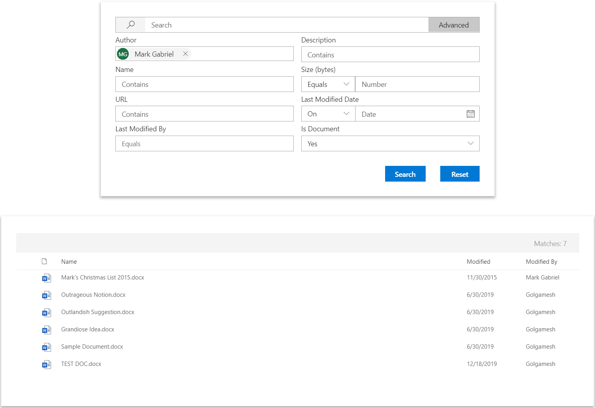
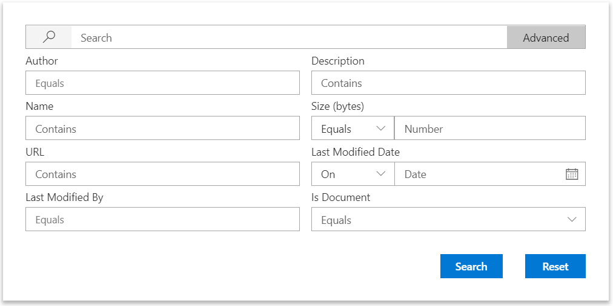
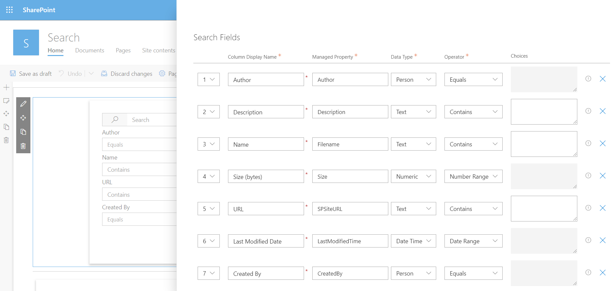
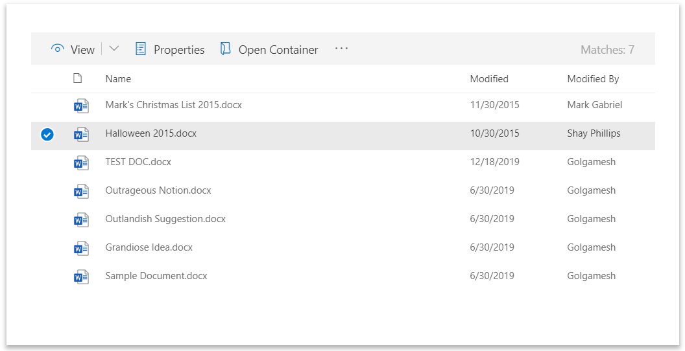
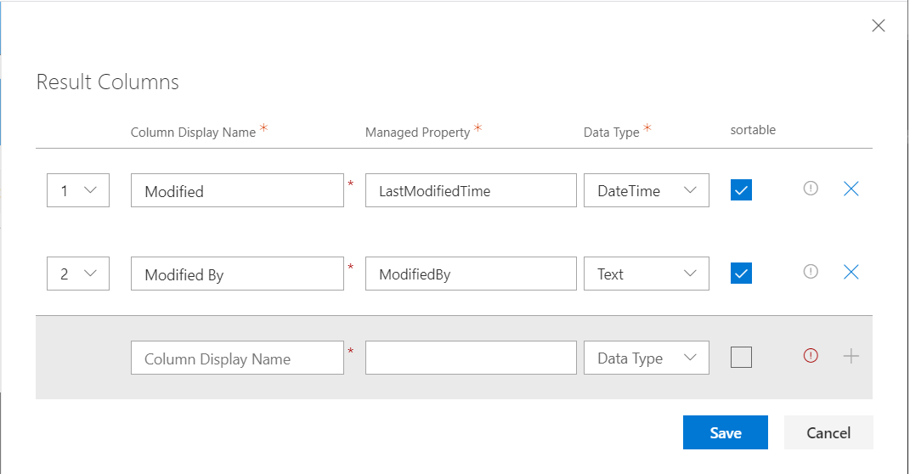

# Swivel Search

Swivel Search is a set of SPFx client side web parts which provide a highly customizable interface for performing metadata property searches against lists and document libraries in Office 365 SharePoint Online.



## Search Web Part

Inspired by classic SharePoint Advanced Search pages, Swivel Search provides an easy interface to perform metadata search queries.



### Customization

The default query fields can be easily modified to any desired search schema that is available on your tenant. 



#### Controls by Data Type

Aside from a text box, the search web part provides custom controls for query construction based on the field's data type which includes:

* People Picker
* Date Range Picker
* Number Range Picker
* Select Box

## Search Results Web Part

The Swivel Results web part is designed to bring the modern list view aesthetic to search results. Although it is intended to work in conjunction with the Search web part, the results web part is capable of standing alone as well.



### Customization

Likewise, the Swivel Search Results web part allows you to select which columns are displayed.



### For more information

* [README](./README.md)
* [Swivel Search Customization](./Search-Customization.md)
* [Swivel Search Results Customization](./Results-Customization.md)
* [Selecting Managed Properties](./Selecting-Managed-Properties.md)
* [Github Repositry](
https://github.com/markgab/swivel-search)

### Building the code

```bash
git clone the repo
npm i
npm i -g gulp
gulp
```

This package produces the following:

* lib/* - intermediate-stage commonjs build artifacts
* dist/* - the bundled script, along with other resources
* deploy/* - all resources which should be uploaded to a CDN.

### Build options

gulp clean - TODO
gulp test - TODO
gulp serve - TODO
gulp bundle - TODO
gulp package-solution - TODO
